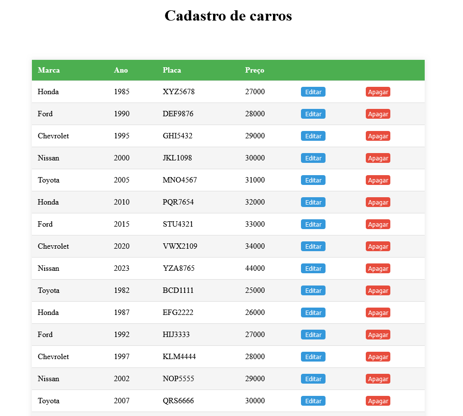

## CRUD Typescript - Vue
A  Aplicação mostra como criar um CRUD usando Typescripe e VueJS deixanda assim o back-and completamente separado do front-and.



### Clone o projeto 
bash
```
git clone https://github.com/Makerjunior/Crud-Typescript-Vue/tree/Update2.git
```
### Instale as dependêndias 
```
npm i
```
Inicialize o back-end na pasta app
```
npm run start
```
Inicialize o front-end na pasta client/Client
```
npm run dev
```